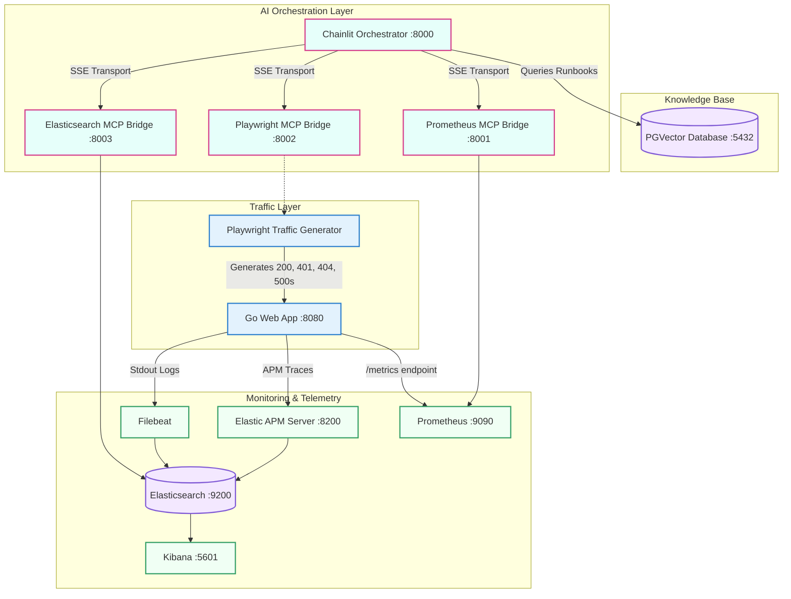

# Diagnostic AI Responder

This project simulates a highly sophisticated, AI-driven Incident Response architecture. It features a complete telemetry stack, a synthetic traffic generator producing anomalies, and an AI Orchestration layer (Chainlit) equipped with Model Context Protocol (MCP) tools to automatically investigate and diagnose system failures.

## Architecture Diagram



## System Components

### 1. The Target Application
A highly optimized **Go Web Server** exposing `/login` and `/dashboard` endpoints. 
- **Telemetry**: Instrumented with `prometheus/client_golang` for metrics and `go.elastic.co/apm` for distributed tracing.
- **Injected Bug**: It features an intentional bug where any password containing an exclamation point (`!`) will trigger a fatal `500 Internal Server Error`, capturing the stack trace and pushing it to Elastic APM.

### 2. Synthetic Traffic
A **Playwright Node.js Script** that runs continuously in a loop, simulating various users logging in. It generates a steady stream of `200 OK` responses, `404 Not Found` errors, and deliberately triggers the `!admin` bug to spike the 500 error rate.

### 3. Monitoring Infrastructure
- **Elasticsearch 7.17 & Kibana**: The central data lake and visualization engine.
- **Filebeat**: Automatically ingests all Docker stdout logs from the Go application.
- **APM Server**: Receives tracing data, allowing engineers (or AI) to see exact latency waterfalls and application exceptions.
- **Prometheus**: Scrapes the `/metrics` endpoint to track overall HTTP request rates and latencies.

### 4. Knowledge Base
- **PGVector**: A PostgreSQL database enhanced with vector search capabilities. It is seeded via an initialization script with technical "Runbooks" that describe known bugs and remediation steps (e.g., the exclamation point bug).

### 5. AI Orchestration
- **Chainlit**: A pure-Python conversational AI framework that acts as the "brain" of the incident responder. It orchestrates the **DeepSeek-Reasoner (R1)** model to investigate spikes in metrics and analyze log files via its intuitive chat UI. It features real-time LLM token streaming and detailed token usage visualization.
- **MCP Proxies**: Because standard Model Context Protocol (MCP) servers communicate via `stdio`, we utilize the `mcp-proxy` wrapper to expose the Elasticsearch, Prometheus, and Playwright tools as Server-Sent Event (SSE) HTTP endpoints. The Chainlit app queries these endpoints across the Docker network to gain real-time access to the cluster's telemetry data.

## Getting Started
1. Export your DeepSeek API key in your terminal so Chainlit can access it:
   ```bash
   export DEEPSEEK_API_KEY="your_api_key_here"
   ```
2. Run `docker-compose up -d --build` to spin up the telemetry stack, the target application, the PGVector runbook database, and the Chainlit interface.
   - *Note: The `mcp-playwright` container uses the official `v1.60.0-jammy` image and includes explicit `Xvfb` display bindings, `ipc: host`, and `seccomp:unconfined` settings to securely support headed/headless browser testing without sandbox crashes.*
3. Run `npx playwright test` to start the continuous traffic generator.
4. Open the Chainlit Interface at `http://localhost:8000` to unleash your AI diagnostic responder!

## Automated AI Investigation
The Chainlit app is pre-configured with a system prompt and direct access to your MCP telemetry tools. 
Simply type: **"Investigate the login 500 errors"** and watch the AI autonomously orchestrate Playwright tests and Elasticsearch log queries!